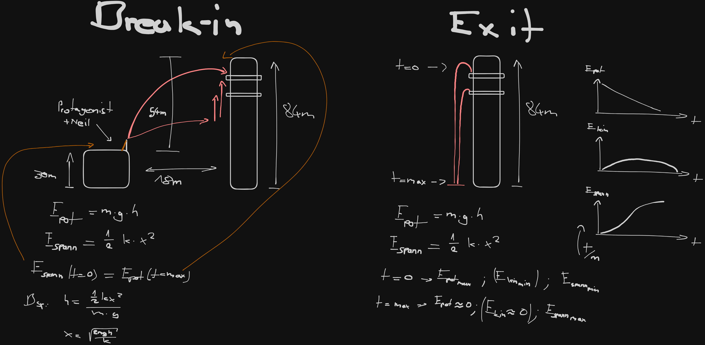
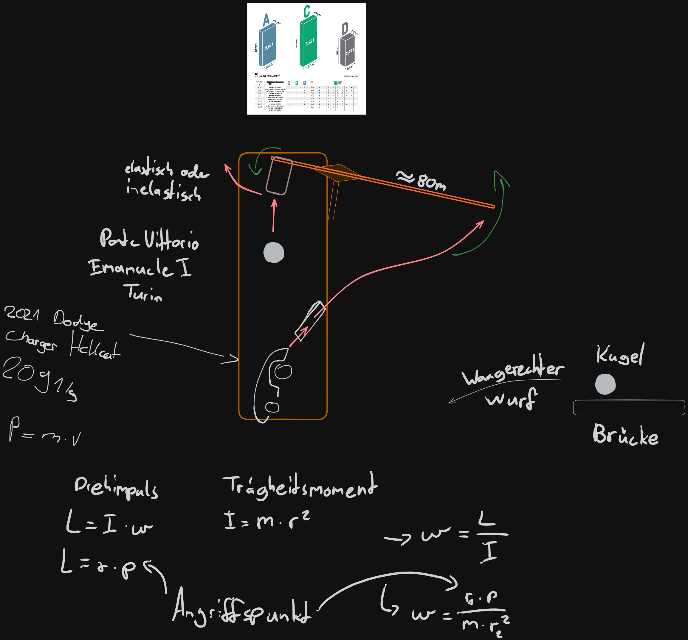

<details>
<summary>Erweitern für den aktuellen (28-09-25) Projektbaum</summary>

```
./root
¦   .gitignore
¦   readme.md
¦   toc.md
¦   tree.txt
¦   
+---docs
¦   ¦   index.html
¦   ¦   README.md
¦   ¦   script.js
¦   ¦   styles.css
¦   ¦   
¦   +---demo
¦           matterjsPreviewTest.html
¦           plotlyPreviewTest.html
¦           
+---ignore
¦   	excluded_large_movie_files
¦   	past_sketches
¦   	or_showcase_backups
¦                   
+---rw-params
¦   +---fastX
¦   ¦       exported_links_13-5-2025_15-42-34.html
¦   ¦       FastX-compressed-inRoma.mp4
¦   ¦       
¦   +---tenet
¦       ¦   datapoints_tenet.json
¦       ¦   Tenet-compressed-Breaking_into_Sanjay_Singh's_house.mp4
¦       ¦   
¦       +---assets
¦               compilation_tenet_dark_bg.excalidraw.png
¦               compilation_tenet_light_nobg.excalidraw.svg
¦               readme.md
¦               VardhamTower-Hemer-south_view--shree-vardhan-south-elevation.png
¦               VardhamTower-Hemer-west_view--shree-vardhan-bhulabhai-desai-marg-warden-road.png
¦               VardhamTower-Hemer-west_view--shree-vardhan-upper-floors-behind-geeta-building.png
¦               VardhamTower-maps-east_view.png
¦               VardhamTower-maps-north-west_view.png
¦               VardhamTower-maps-north_view.png
¦               VardhamTower-maps-south-east_view.png
¦               VardhamTower-maps-south_view.png
¦               VardhamTower-osm_buildings-maps-environment.png
¦               VardhamTower-satellite-maps-environment.png
¦               VardhamTower-satellite-maps.png
¦               VardhamTower-Tenet-west_view-aerial.png
¦               
+---scripts
¦   +---pythonProject
¦       ¦   fastX-br.py
¦       ¦   webp-to-png.py
¦       ¦   
¦       +---.idea
¦           ¦   .gitignore
¦           ¦   misc.xml
¦           ¦   modules.xml
¦           ¦   pythonProject.iml
¦           ¦   vcs.xml
¦           ¦   
¦           +---inspectionProfiles
¦                   profiles_settings.xml
¦                   
+---sketches
    +---fastX
    ¦   ¦   fastX_dark_bg.excalidraw.png
    ¦   ¦   fastX_light_nobg.excalidraw.svg
    ¦   ¦   sequences_1x_light_nobg.excalidraw.svg
    ¦   ¦   sequences_3x_dark_bg.excalidraw.png
    ¦   ¦   
    ¦   +---sequence-descriptions
    ¦           sequences2-geometry.excalidraw
    ¦           
    +---tenet
            tenet_dark_bg.excalidraw.png
            tenet_light_nobg.excalidraw.svg
            
```
</details>

# Bisherige Skizzen:
<details>
<summary>Veraltet</summary>

## Tenet Ein- und Ausbruch

## Tenet Gebäude Analyse

### Bildquellen
[Markdown Datei](rw-params/tenet/assets/readme.md)
### Kennziffern
[Attribute wichtiger Objekte](rw-params/tenet/datapoints_tenet.json)
</details>

---

---
# Gegenwärtiger Bearbeitungsgegenstand

## Fast X Saving Rome Sequenzübersicht


## Fast X Kausalkette 



<!-- TODO insert geometry descriptions once finished -->

### Literaturquellen
[Provisorische Liste einiger in der Recherche verwendeter Quellen](rw-params/fastX/exported_links_13-5-2025_15-42-34.html) <!--TODO needs updating -->